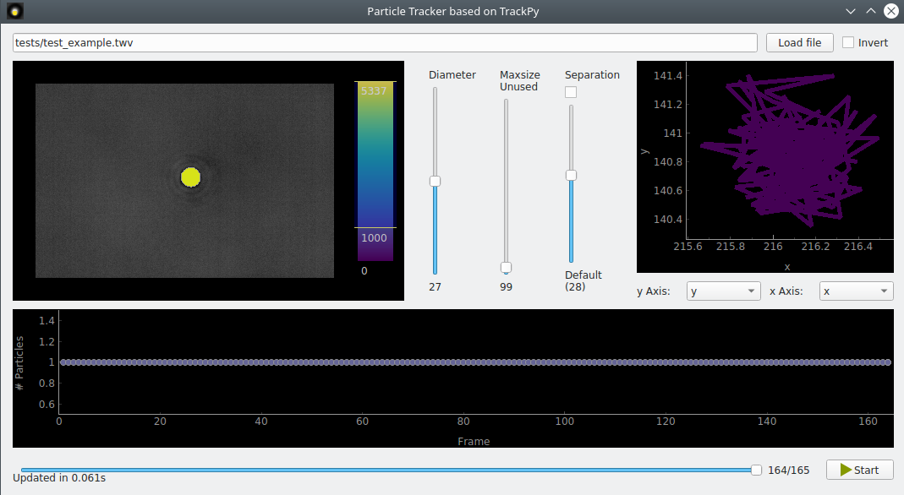

.. _ref-data-extraction:

Data extraction
===============

Let us assume that all the necessary experiments have been carried out and all the relevant raw data recorded. It is most likely in the form of images from a microscope's focal plane, either as single frames, consecutive frames or an obscure video format. While the specified positions and strengths of optical traps can generally be found either in the image/video metadata or imported from another file, the positions of particles are, of course, unknown - hence the recording! They need to be visually identified, tracked and their movement extracted.

Besides data analysis, ``Optical tweezer tools`` is also intended to be used for this identification and extraction. The particle tracking functionality is provided on the base of `TrackPy <http://soft-matter.github.io/trackpy/>`_; or with our costum tracker. We include a graphic interface in a `separate repository <https://github.com/zgosar/GUI_for_ParticleTracking>`_ to give feedback when adjusting parameters and for previewing frames. 

First, the images or video frames need to be loaded. For a sequentially labelled series of *n* images (e.g. *0.png*, *1.png*, ...), this is done via

.. code-block:: python

    frames = [np.array(Image.open("your_data_folder\\{:}.png".format(i))) for i in range(len(n))]

Usage of `pims <https://pypi.org/project/PIMS/>`_ is supported for opening of files of many formats.

Using TrackPy
-------------
    
Then, any particles present in each frame which fit the given parameters are identified. Through TrackPy, this can be done for individual frames or with a batch function. Let's say we wish to identify particles of around 15 px diameter in the n-th image:

.. code-block:: python

    import trackpy

    features = trackpy.locate(frames[n-1], 15, minmass=1000)
    
This will locate Gaussian features of approximately the chosen size. The batch function performs the same operation, on all frames.

.. code-block:: python

    features = trackpy.batch(frames,15,minmass=1000)

The next step is linking the positions together to tracks - we wish to know how each particle moves over the course of the recording, and to make sure that close particles don't get mistaken for one another. The maximum allowed distance is the number of pixels a feature can move between consecutive frames while still being treated as the same particle, and the same is true if cannot be found in max. 10 frames.

.. code-block:: python

    tracks = tp.link_df(features, max_distance, memory=10)

For more details on how to use TrackPy see the documantation `<http://soft-matter.github.io/trackpy/>`_.

Our Tracker
-----------
    
Alternatively, a non-TrackPy approach can identify features in the 1st frame and then similarly locate and track particles in all frames. Here, any pixel brighter (*invert=False*) than the treshold value starts a flood fill around its position. Features with pixel counts between *min_size* and *max_size* are retained, the rest discarded. *max_distance* fulfills the same role as above.
    
.. code-block:: python

    import tracking
    
    positions = simple_tracking(frames, treshold_value, invert=False,min_size,max_size,max_distance)
    
Other Data
----------

Besides the positions, every frame also needs the aforementioned metadata, namely the time at which the frame was taken (relative to the 1st one), the laser power, and information about the traps- their powers and positions. If only a single trap is active, this means 5 values per frame, 8 if 2 are active etc. Once the values for all frames are saved to arrays, the data can be written into a file for future reference before further analysis. Use one of the below functions: if simple tracking was used, the correct function would be *save_tracked_data*; otherwise, use *save_tracked_data_pandas*.

.. code-block:: python

    save_tracked_data('name_of_output_file.dat', number_of_frames, tracks, times, laser_powers, traps)
    
    save_tracked_data_pandas('name_of_output_file.dat', frames, tracks, times, laser_powers, traps)

The data is now saved in a format which can easily be read back into the program (see: :ref:`ref-read-data`).

.. note::
    The positions of both traps and particles are output in pixels. In the likely case that your experimental setup captures images at a different resolution than :math:`1 \mu m / px`, you will need to multiply the trajectories and trap data with a scaling factor.

Working with the GUI
--------------------------

Parameters like feature diameter and "size" need to be specified for some of the above functions to be run. If they are unknown, trial and error is one possible approach, but estimating them through the GUI can be useful even if all the other work is done through the command line. Once you have loaded the recording, change the values of the Diameter as well as minimum pixel count ("mass") sliders until the program has labelled all particles, but no false positives (spurious features). The minimum mass slider is found on the right-hand side of the preview window and can be adjusted by clicking and dragging the horizontal line. The lowermost horizontal slider controls which image/frame of the sequence is displayed and can be used to make sure that the correct features will keep being identified over the course of the recording.

    
    Image of the GUI showing a loaded and already tracked sample file.
